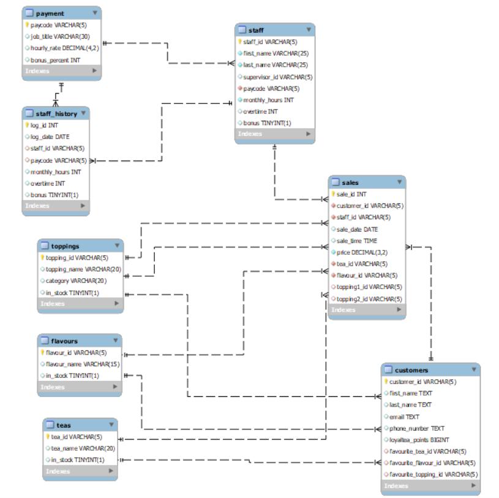

# Bubble Tea Shop Database

This project was created as part of the **Code First Girls Data & SQL Coding Kickstarter**. The database aims to store relevant information about the staff, stock and sales of a fictional boba shop, while demonstarting
everything I learned on the course.

## Data Dictionary [under construction]

### Staff data tables

```staff``` table — stores information about currently employed staff and their hours/pay for the current month
| Column Name   | Description                      | Data Type    | Permitted Values |
|---------------|----------------------------------|--------------|------------------|
| staff_id      | Unique identifier                | VARCHAR(5)   |                  |
| first_name    | First name of staff member       | VARCHAR(25)  |                  |
| last_name     | Last name of staff member        | VARCHAR(25)  |                  |
| supervisor_id | ```staff_id``` of supervisor     | VARCHAR(255) |                  |
| paycode       | Code for payment info            | VARCHAR(5)   | Foreign Key ```payment.paycode```|
| monthly_hours | Contracted hours for 4 weeks     | INT          |                  |
| overtime      | Hours worked overtime this month | INT          |                  |
| bonus         | Whether this staff member will receive a bonus | BOOLEAN      |                  |

```payment``` table — stores information about how much staff with particular roles must be paid
| Column Name   | Description                           | Data Type    | Permitted Values |
|---------------|---------------------------------------|--------------|------------------|
| paycode       | Unique identifier                     | VARCHAR(5)   |                  |
| job_title     | Job title of staff on this rate       | VARCHAR(30)  |                  |
| hourly_rate   | £/hr paid to staff on this code       | DEC(4,2)     |                  |
| bonus_percent | % of wages given as bonus if eligible | INT          |                  |

```staff_history``` — stores previous records from ```staff``` table after an update
| Column Name   | Description                           | Data Type    | Permitted Values |
|---------------|---------------------------------------|--------------|------------------|
| log_id        | Unique identifier                     | INT          | numbers > 1      |
| log_date      | Date row was added to table           | DATE         |                  |
| staff_id      | Unique identifier                     | VARCHAR(5)   | Foreign Key ```staff.staff_id```|
| paycode       | Code for payment info                 | VARCHAR(5)   | Foreign Key ```payment.paycode```|
| monthly_hours | Contracted hours for 4 weeks          | INT          |                  |
| overtime      | Hours worked overtime that month      | INT          |                  |
| bonus         | Whether this staff member received a bonus | BOOLEAN      |                  |

### Stock data tables

### Sales data tables

## EER Diagram

